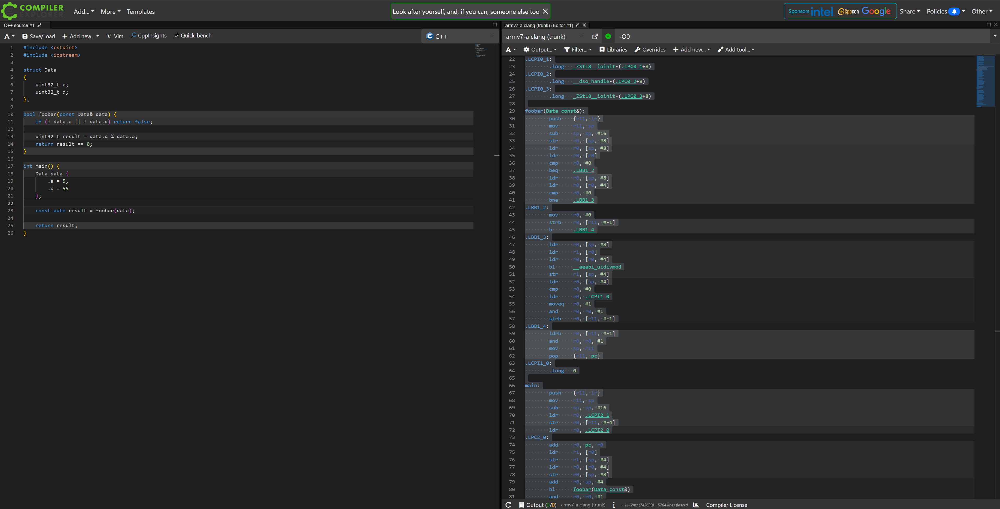

# Understanding References in C++ via ARM Assembly

This project demonstrates how **C++ references** are implemented under the hood, by looking at compiler-generated assembly.

### Try the Code Live

You can interactively explore the C++ code and its ARM assembly output using Compiler Explorer:

[View on Godbolt](https://godbolt.org/z/TvWYb535E)
  
Or click the screenshot below to launch it:

[](https://godbolt.org/z/TvWYb535E)


We use a simple struct and pass it to a function by `const &` reference:

```cpp
struct Data {
    uint32_t a;
    uint32_t d;
};

bool foobar(const Data& data) {
    if (! data.a || ! data.d) return false;

    uint32_t result = data.d % data.a;
    return result == 0;
}
```

---

## How References Work
In C++, a reference (`const Data&`) is **not copied** — the compiler simply passes a **pointer** to the object.  

In the generated ARM assembly, you can see this in `foobar`:

### Function prologue (reference is just a pointer)
```asm
foobar(Data const&):
    push    {r11, lr}
    mov     r11, sp
    sub     sp, sp, #16
    str     r0, [sp, #8]     ; store the incoming pointer (reference)
```
 `r0` contains the **address of `Data`**, not the struct itself.  
This confirms that **a reference is just a pointer under the hood**.

### Accessing fields through the reference
```asm
    ldr     r0, [sp, #8]     ; load pointer to data
    ldr     r0, [r0]         ; load data.a

    ldr     r0, [sp, #8]
    ldr     r0, [r0, #4]     ; load data.d (offset +4)
```

### Modulo operation + return
```asm
    ldr     r0, [sp, #8]
    ldr     r1, [r0]         ; a
    ldr     r0, [r0, #4]     ; d
    bl      __aeabi_uidivmod ; r1 = d % a
    cmp     r0, #0           ; (note: ABI returns quotient in r0, remainder in r1; remainder was stored earlier)
    moveq   r0, #1
    and     r0, r0, #1
```
If remainder == 0, return `true`, else `false`.

> **ABI note**: On ARM EABI, `__aeabi_uidivmod` returns quotient in `r0` and remainder in `r1`. The code stores `r1` and later checks if it’s zero.

---

## What Happens in `main` (Step-by-step)

C++:
```cpp
int main() {
    Data data { .a = 5, .d = 55 };
    const auto result = foobar(data);
    return result;
}
```

Assembly highlights (labels trimmed for clarity):

```asm
main:
    push    {r11, lr}
    mov     r11, sp
    sub     sp, sp, #16

    ldr     r0, .LCPI2_0
.LPC2_0:
    add     r0, pc, r0       ; r0 = &.L__const.main.data (pc-relative)
    ldr     r1, [r0]         ; r1 = 5
    str     r1, [sp, #4]     ; data.a on stack
    ldr     r0, [r0, #4]     ; r0 = 55
    str     r0, [sp, #8]     ; data.d on stack

    add     r0, sp, #4       ; r0 = &data (address of local object)
    bl      foobar(Data const&) ; call with a *reference* (pointer)

    and     r0, r0, #1       ; normalize bool -> 0/1
    strb    r0, [sp, #3]     ; store as byte
    ldrb    r0, [sp, #3]
    and     r0, r0, #1       ; ensure return in r0 is 0/1
    mov     sp, r11
    pop     {r11, pc}

.L__const.main.data:
    .long   5
    .long   55
```
**Explanation:**  
- The constants `5` and `55` live in a small **read-only literal block** (`.L__const.main.data`).  
- The compiler **copies** them to a stack-allocated `Data` at `[sp+#4]` and `[sp+#8]`.  
- It then passes the **address** of that stack object in `r0` to `foobar`, which is exactly how a `const Data&` is passed.  
- The boolean result is normalized and returned in `r0` as the program’s exit code.

---

## Why is there `__cxx_global_var_init` / iostream init?

You’ll also see assembly like:
```asm
__cxx_global_var_init:
    ... 
    bl  std::ios_base::Init::Init() [complete object constructor]
    ...
    bl  __cxa_atexit
```
This is the standard **iostreams global initialization** (constructs a `std::ios_base::Init` guard and registers its destructor).  
It appears because `<iostream>` is included, even though we don’t use `std::cout`. If you remove the include, this section typically disappears.

---

##  Build & Run
```bash
mkdir build && cd build
cmake ..
make
./references_demo
```

---

## Key Takeaways
- A `const T&` parameter is compiled as **passing a pointer to `T`**.  
- Accessing members of the reference is just **pointer dereferencing in assembly**.  
- `main` constructs a local `Data`, then passes its **address** to `foobar`.  
- `<iostream>` triggers global iostream initialization code, which is unrelated to references.

---

## Files
- `src/main.cpp` → C++ code
- `asm/arm_clang_full.s` → Full assembly dump provided
- `README.md` → Explanations (includes `main` walk-through)
